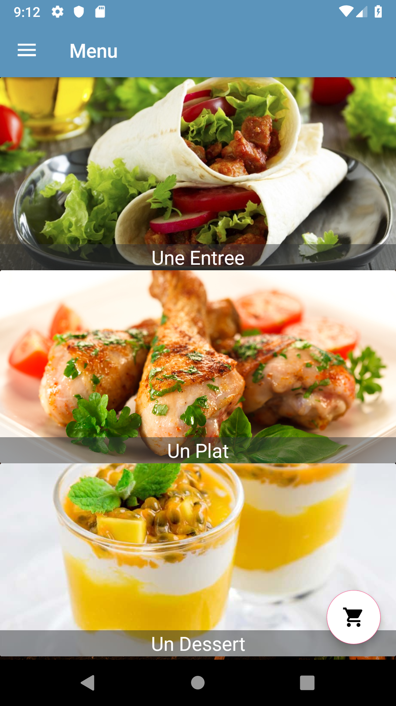
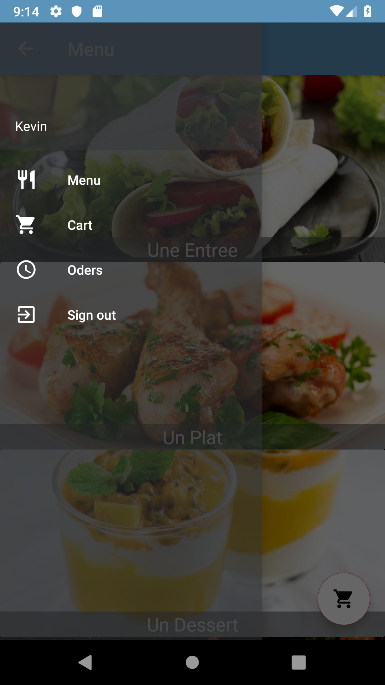

# Newrest — Android Food Ordering App (School Restaurant)

Android app that helps students **pre-order meals** from the school restaurant and helps the restaurant **anticipate demand** (reduce waste, avoid stockouts).


<p align="center">


</p>

---
## Table of Contents
- [Overview](#overview)
- [Problem](#problem)
- [Solution](#solution)
- [Key Features](#key-features)
- [Screens / Activities](#screens--activities)
- [Tech Stack](#tech-stack)
- [Firebase Database Structure](#firebase-database-structure)
- [Project Structure](#project-structure)
- [Setup & Installation](#setup--installation)
- [Usage](#usage)
- [Constraints / Notes](#constraints--notes)
- [Roadmap](#roadmap)
- [Contributing](#contributing)
- [License](#license)
- [Acknowledgements](#acknowledgements)

---

## Overview
**Newrest** is a mobile ordering system built to improve the daily workflow of a school restaurant:
- Students can **register/login**, **browse the menu**, **select dishes**, and **place an order**.
- The restaurant can consult orders stored in **Firebase** to better plan production.

---

## Problem
The restaurant often faces:
- **overproduction / underproduction** because daily demand is hard to estimate
- student frustration when dishes run out too early

A previous solution (shared daily Excel file) was limited and inconvenient.

---

## Solution
A simple Android ordering app where:
- students **reserve meals in advance** (before a cutoff time)
- orders are stored in a centralized database (Firebase)
- the restaurant can **see demand per dish** early enough to adjust production

---

## Key Features
- **Authentication**
  - Sign up (phone number, name, password)
  - Sign in (phone number, password)
- **Menu browsing**
  - Categories: **Entrées**, **Plats**, **Desserts**
  - Dish listing per category
  - Dish detail view (description + selection)
- **Cart & Order**
  - Add dishes to cart
  - Order summary (items + total price)
  - Order status / history
  - Constraint: **1 order per day** (as described in the project report)
- **Admin (via Firebase Console)**
  - Menu updates + order consultation directly from Firebase console

---

## Screens / Activities
The application is organized around the following activities:
1. **MainActivity** — Welcome screen: Login / Register  
2. **SignIn** — Login (phone + password)  
3. **SignUp** — Registration (phone + name + password)  
4. **Home** — Categories (Entrée / Plat / Dessert)  
5. **FoodList** — Dishes list for a selected category  
6. **FoodDetail** — Dish details + add to cart  
7. **Cart** — Selected items + order summary  
8. **OrderStatus** — Order history/status (+ daily ordering rule)

---

## Tech Stack
- **Android Studio**
- **Java (Android)**
- **Firebase Realtime Database** (menu + users + orders)
- UI components based on Android layouts + RecyclerView pattern

---

## Firebase Database Structure
Firebase nodes used in the project:

### `Category`
Stores the 3 menu categories:
- `Name`
- `Image` (URL)

### `Food`
Stores dishes:
- `Name`
- `Description`
- `Price`
- `CategoryId` (or equivalent link to category)

### `User`
Stores users:
- `Phone` (identifier)
- `Name`
- `Password`

### `Requests`
Stores orders:
- `Name`
- `Phone`
- `Total`
- `Status` (picked up / not picked up, etc.)
- Ordered items (depending on your implementation)


---
###  Usage

1) Launch the app
2) Sign up (phone, name, password)
3) Sign in
4) Browse categories on Home
5) Select a dish -> FoodDetail -> Add to cart
6) Confirm in Cart
7) Check your order in OrderStatus

### Roadmap
- Security:
  - Hash passwords (BCrypt/Argon2)
  - Stricter Firebase rules
- Admin dashboard inside the app (instead of Firebase console)
- Push notifications (menu published / order ready)
- Analytics (demand by day/dish) for planning/forecasting

### Licence
MIT 

## Setup & Installation

### Prerequisites
- Android Studio installed
- A Firebase project with **Realtime Database** enabled
- (Recommended) Android emulator or a physical Android device

## Setup & Installation

### Prerequisites
- Android Studio installed
- A Firebase project with **Realtime Database** enabled
- (Recommended) Android emulator or a physical Android device
- You can Download the entire project here : https://drive.google.com/drive/folders/1qQcXl6R2uIwd1_iRkW6hf8sNEoyZ7pOA?usp=drive_link

### Steps

```text
1) Clone the repository
   - Open a terminal
   - Run:
     git clone <YOUR_REPO_URL>
     cd <YOUR_PROJECT_FOLDER>

2) Open the project in Android Studio
   - Launch Android Studio
   - Click: File -> Open
   - Select: <YOUR_PROJECT_FOLDER>
   - Wait for Gradle Sync to finish (bottom bar)

3) Connect Firebase (google-services.json)
   - Go to Firebase Console
   - Create a Firebase Project (or select an existing one)
   - Open: Project Settings -> General -> Your apps
   - Click: Add app -> Android
   - Fill:
       - Android package name: com.your.package
       - (Optional) App nickname
       - (Optional) SHA-1 (for some Firebase features)
   - Download: google-services.json
   - Put the file here:
       <YOUR_PROJECT_FOLDER>/app/google-services.json

4) Enable Firebase Realtime Database
   - Firebase Console -> Build -> Realtime Database
   - Click: Create Database
   - Choose a region
   - Choose mode:
       - Test mode (dev only) OR
       - Locked mode (recommended) then set rules

5) Create database nodes (tables)
   - In Realtime Database -> Data tab
   - Create top-level nodes:
       - Category
       - Food
       - User
       - Requests

6) Seed minimal data (example)
   - Category:
       - { id: "1", Name: "Entrees",  Image: "<url>" }
       - { id: "2", Name: "Plats",    Image: "<url>" }
       - { id: "3", Name: "Desserts", Image: "<url>" }
   - Food:
       - { id: "101", Name: "Pizza", Description: "...", Price: 1500, CategoryId: "2" }
       - { id: "102", Name: "Salade", Description: "...", Price: 800,  CategoryId: "1" }

7) Run the app
   - In Android Studio:
       - Select a device (emulator or phone)
       - Click: Run (green play button)

